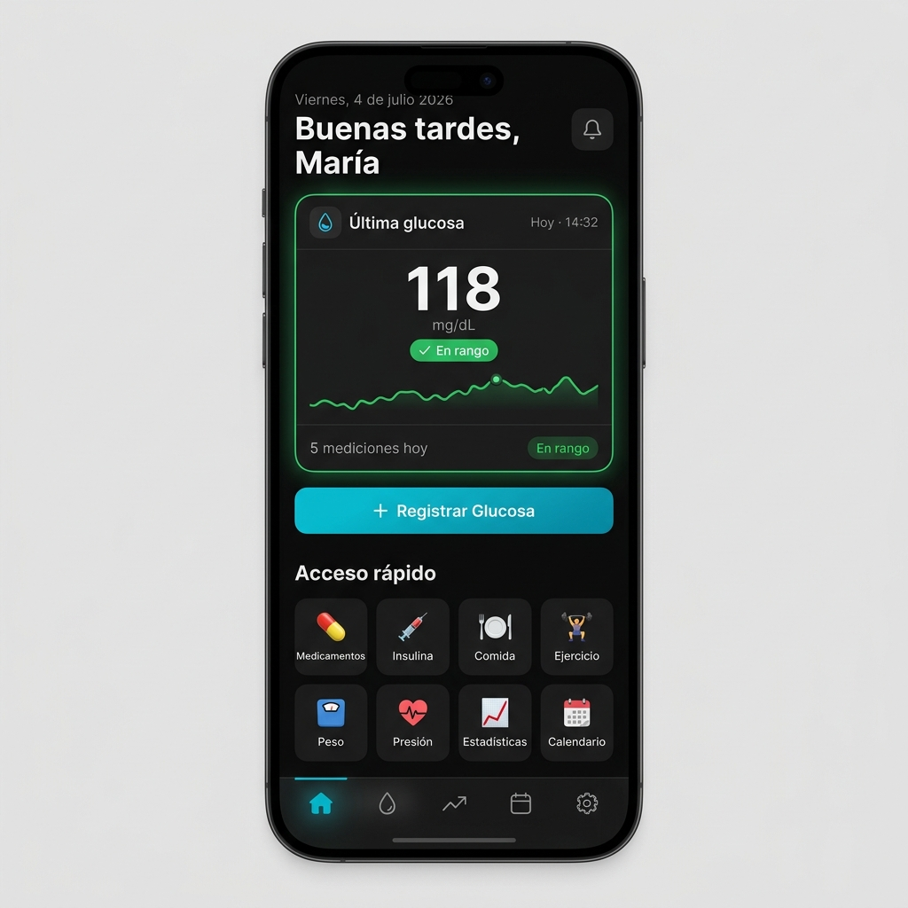
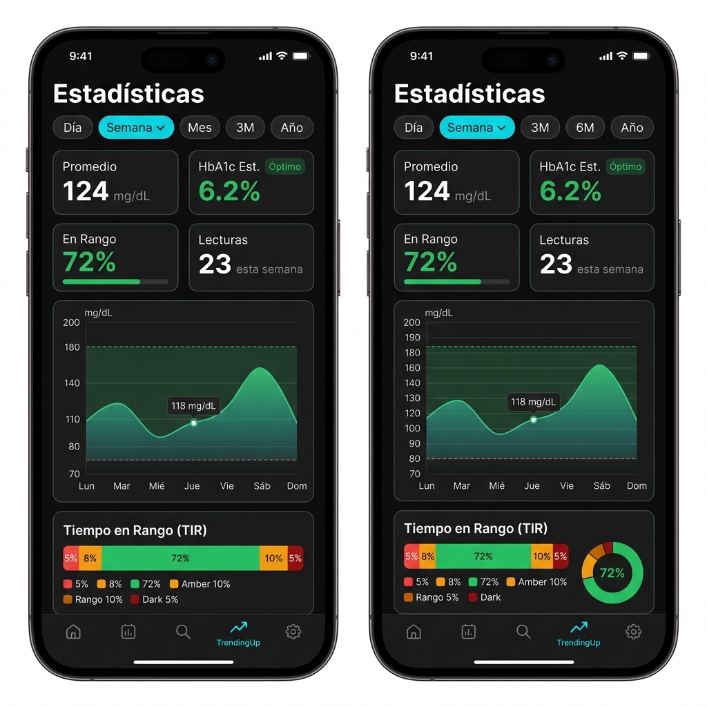
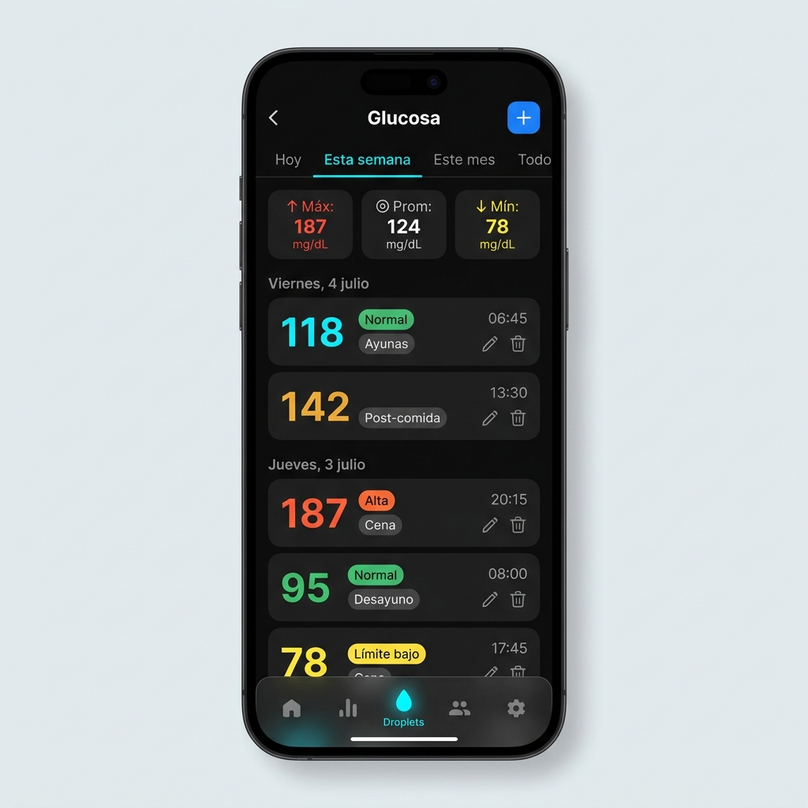
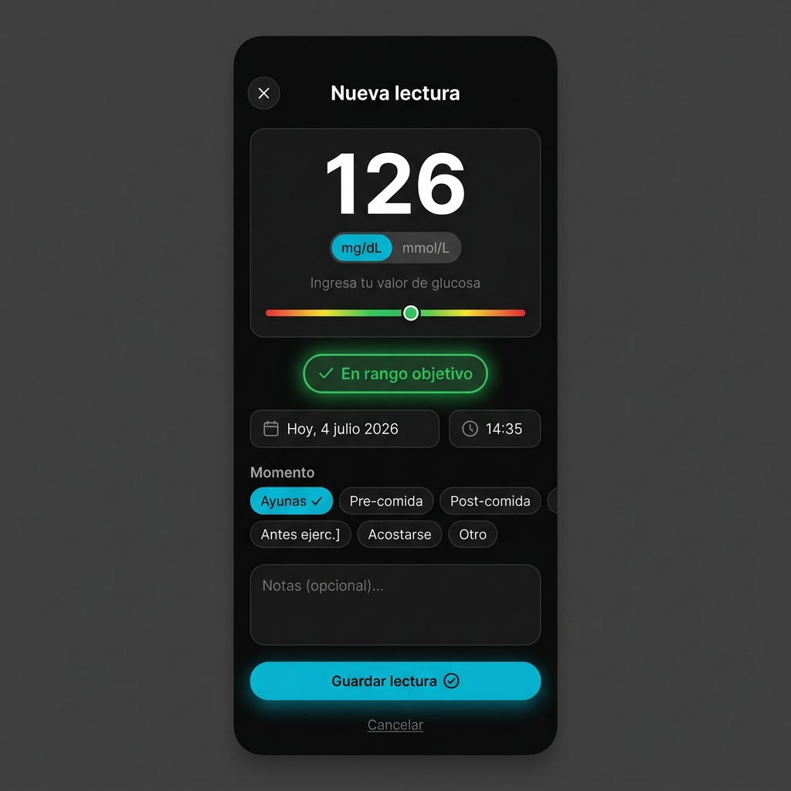
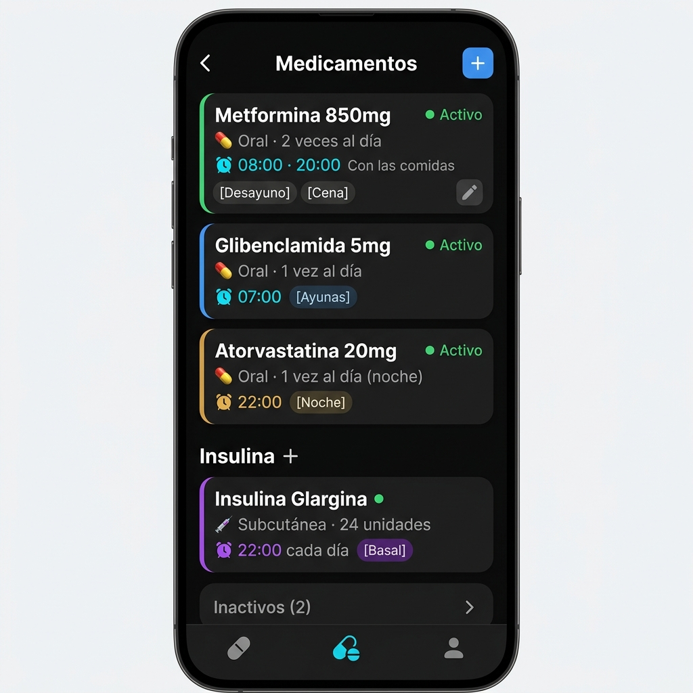
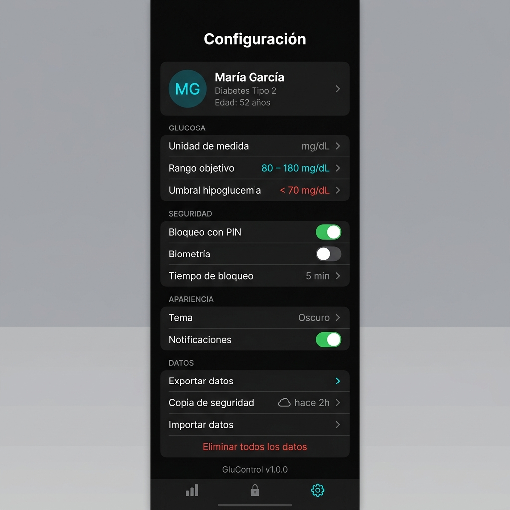

# 🩺 GluControl

> **Ecosistema Profesional de Monitoreo & Control de Diabetes**  
> *Una solución empresarial de grado médico, de código abierto, sin conexión a internet (Offline-First) y multiplataforma (Web, PWA, Android, iOS).*

---

[](https://react.dev/)
[](https://www.typescriptlang.org/)
[](https://vitejs.dev/)
[](https://capacitorjs.com/)
[](https://dexie.org/)
[](LICENSE)

---

## 📋 Descripción General

**GluControl** es una suite médica digital diseñada para simplificar y optimizar el seguimiento diario de la diabetes y la salud metabólica. Desarrollada con altos estándares de ingeniería de software, la aplicación ofrece a pacientes y profesionales de la salud un sistema unificado para el registro de glucosa, administración de insulina, control de presión arterial, nutrición, actividad física, peso corporal y planes de medicación.

Al ser una aplicación **Offline-First**, todos los datos clínicos del usuario se procesan y almacenan localmente en el dispositivo mediante una base de datos IndexedDB optimizada, garantizando **privacidad absoluta, velocidad instantánea de respuesta y disponibilidad ilimitada sin necesidad de conexión a Internet**.

---

## 💎 Pilares Tecnológicos

*   🔒 **Privacidad Avanzada (Security-First):** Control total de la información. Pantalla de bloqueo con código PIN personalizable y almacenamiento local 100% privado en el cliente.
*   ✈️ **Offline-First / Zero Cloud Dependence:** Funciona sin internet. Base de datos reactiva e indexada mediante `Dexie.js`.
*   📱 **Multiplataforma Nativa:** Diseñado como PWA (Progressive Web App) instalable y compilable a apps nativas de Android e iOS mediante **CapacitorJS**.
*   📊 **Visualización de Datos Dinámica:** Gráficos analíticos profesionales con `Recharts` para detectar patrones hiper/hipoglucémicos de forma proactiva.
*   📋 **Reportes Exportables:** Generación instantánea de reportes estructurados en formato **PDF** (usando `jsPDF`) y **Excel (XLSX)** (usando `SheetJS`) listos para compartir con médicos especialistas.

---

## 📸 Galería Visual de la Plataforma

Aquí se muestran capturas reales del sistema en funcionamiento:

<table align="center" width="100%">
  <tr>
    <td width="50%" align="center">
      <h3>📈 Dashboard Ejecutivo</h3>
      
      <p><i>Resumen de métricas clave, estado actual de glucosa, últimas dosis y accesos rápidos.</i></p>
    </td>
    <td width="50%" align="center">
      <h3>📊 Estadísticas & Tendencias</h3>
      
      <p><i>Gráficos interactivos de evolución, promedio por período y distribución de rangos meta.</i></p>
    </td>
  </tr>
  <tr>
    <td width="50%" align="center">
      <h3>📜 Historial Detallado</h3>
      
      <p><i>Bitácora temporal con filtros avanzados, etiquetas de contexto y estados de alerta.</i></p>
    </td>
    <td width="50%" align="center">
      <h3>📝 Registro Rápido</h3>
      
      <p><i>Formularios validados con Zod para registrar glucosa, comidas y notas contextuales.</i></p>
    </td>
  </tr>
  <tr>
    <td width="50%" align="center">
      <h3>💊 Control de Medicamentos</h3>
      
      <p><i>Planificador de dosis, horarios y registro de tomas de medicamentos activos.</i></p>
    </td>
    <td width="50%" align="center">
      <h3>⚙️ Configuración & Backups</h3>
      
      <p><i>Gestión de perfil, PIN de seguridad, exportación e importación de respaldos en JSON.</i></p>
    </td>
  </tr>
</table>

---

## 🛠️ Arquitectura y Stack Tecnológico

El proyecto está diseñado bajo un modelo de **arquitectura desacoplada en capas**, lo que facilita el mantenimiento y la portabilidad tecnológica (por ejemplo, migrar en el futuro el motor de almacenamiento de IndexedDB a SQLite sin alterar la UI).

```
src/
├── core/         # Constantes, Logger y configuración transversal
├── entities/     # Modelos de datos y esquemas de validación Zod
├── database/     # Adaptador de base de datos IndexedDB (Dexie)
├── repositories/ # Patrón Repositorio (Acceso y persistencia de datos)
├── stores/       # Manejo de estado reactivo y global (Zustand)
├── hooks/        # Lógica y hooks reutilizables (ej. PWA, install)
├── components/   # UI Kit modular y atómico (Toasts, Spinners, etc.)
└── pages/        # Vistas funcionales (Dashboard, Glucosa, Medicamentos, etc.)
```

### Tecnologías Core:

| Tecnología | Propósito | Beneficio Clave |
| :--- | :--- | :--- |
| **React 18** | Biblioteca UI | Renderizado óptimo basado en componentes declarativos. |
| **TypeScript** | Tipado Estático | Seguridad en tiempo de compilación y autocompletado robusto. |
| **Dexie.js** | Capa de Base de Datos | Wrapper de IndexedDB rápido y reactivo con soporte de transacciones. |
| **Zustand** | Store de Estado | Estado global ligero, desacoplado de React para mayor velocidad. |
| **CapacitorJS** | Compilación Nativa | Empaquetado para tiendas de aplicaciones con acceso a APIs de hardware. |
| **Recharts** | Analíticas | Renderizado SVG fluido y responsive para el análisis de métricas. |
| **Vitest** | Testing Suite | Pruebas unitarias ultrarrápidas nativas de Vite. |

---

## 🚀 Guía de Desarrollo e Instalación

Sigue estos pasos para levantar el entorno localmente:

### Requisitos Previos

*   **Node.js:** Versión `>= 18.0.0`
*   **NPM:** Versión `>= 9.0.0`

### 1. Clonar el repositorio e instalar dependencias
```bash
git clone https://github.com/tu-usuario/glucontrol.git
cd glucontrol
npm install
```

### 2. Ejecutar el servidor de desarrollo local
```bash
npm run dev
```
*Abre [http://localhost:5173](http://localhost:5173) en tu navegador para ver la aplicación web interactiva.*

### 3. Compilar para producción (Web/PWA)
```bash
npm run build
```
*Los archivos optimizados y listos para producción se generarán en la carpeta `/dist`.*

### 4. Ejecutar el Suite de Pruebas Unitarias
```bash
# Ejecutar pruebas en consola
npm run test

# Lanzar panel de control visual de Vitest
npm run test:ui

# Obtener informe de cobertura de código
npm run test:coverage
```

---

## 📱 Compilación e Integración Móvil (Capacitor)

GluControl está listo para ser desplegado en dispositivos Android e iOS.

### Android

1. **Agregar plataforma Android (primer setup):**
   ```bash
   npm run cap:add:android
   ```
2. **Compilar Web e Sincronizar con el proyecto Android:**
   ```bash
   npm run cap:build:android
   ```
3. **Abrir el proyecto en Android Studio:**
   ```bash
   npm run cap:open:android
   ```

### iOS

1. **Agregar plataforma iOS (primer setup):**
   ```bash
   npm run cap:add:ios
   ```
2. **Compilar Web e Sincronizar con el proyecto iOS:**
   ```bash
   npm run cap:build:ios
   ```
3. **Abrir el proyecto en Xcode:**
   ```bash
   npm run cap:open:ios
   ```

---

## 🔒 Privacidad y Cumplimiento

Dado el carácter sensible de la información de salud registrada en **GluControl**:
*   **Almacenamiento Local Fuerte:** Ningún dato se envía a servidores de terceros ni queda expuesto en la nube.
*   **Copias de Seguridad Cifradas Localmente:** Los respaldos en formato JSON pueden ser exportados y descargados por el usuario para guardarlos de forma segura en medios externos.
*   **PIN de Seguridad:** Protege el acceso al historial médico si el dispositivo es compartido o prestado.

---

## 📄 Licencia

Este proyecto está bajo la Licencia de Desarrollo Interno / Privada. Consulte los términos del equipo administrador antes de redistribuir o comercializar.

---
*Desarrollado con ❤️ para mejorar la calidad de vida y el control clínico diario.*
# glucontrol

